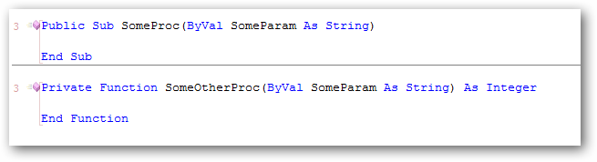
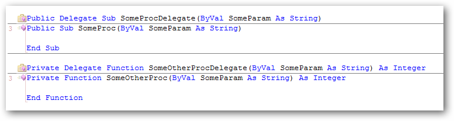
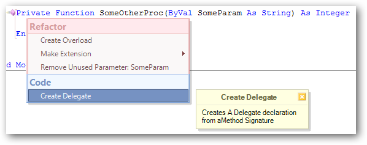

# 'Create Delegate' for CodeRush #

It turns these:

...into these...

### Usage ###
Place your caret on the signature of the method and select '**Create Delegate**' from the Smart tag menu. 

This item will be in blue as it is implemented as a CodeProvider.
